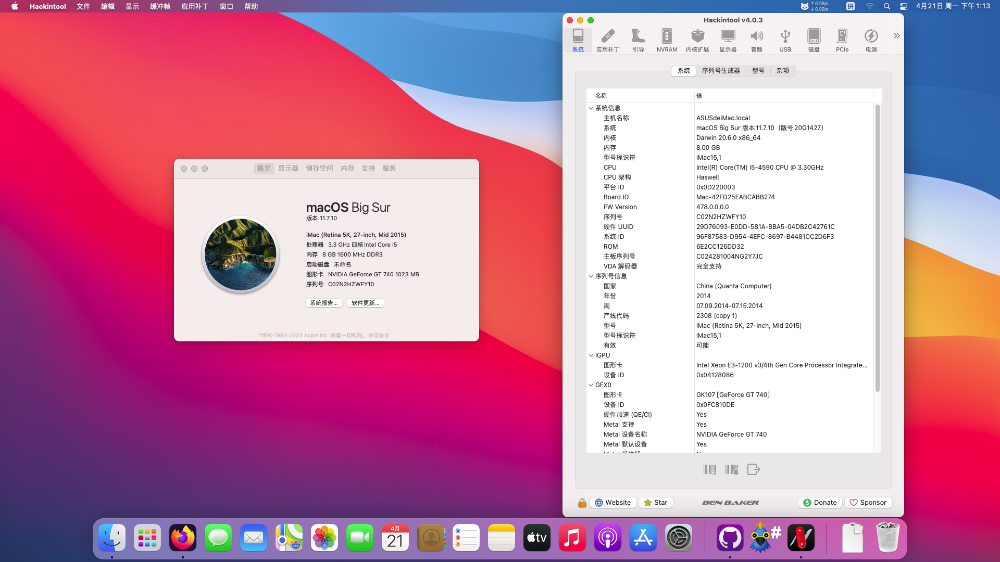

# ASUS-B85-PRO-GAMER-Hackintosh
应用于华硕B85-PRO GAMER的OpenCore 1.0.4的黑苹果引导 支持macOS Big Sur 11.7.10

注意：
- 此EFI不含三码 实际使用时请自行使用[OCAT](https://github.com/ic005k/OCAuxiliaryTools)生成
- 此EFI包含RealTek RTL8169的相关驱动信息，如有需要可使用"Config-含PCI网卡.plist"。


### 配置清单
|类型|型号|规格|
|---|---|---|
|CPU|Intel Core i5-4590|3.30 GHz|
|内存1|Kingston KHX1600C9D3/4GX|1600 MHz|
|内存2|Kingston 99P5474-013.A00LF|1600 MHz|
|SSD|Samsung SSD 860 EVO|512 GB|
|HDD|HGST HTS545050A7E380|500 GB|
|iGPU|Intel HD Graphics 4600|2048 MB|
|dGPU|NVIDIA GeForce GT 740(GK107)|1024 MB|
|网卡1|Intel I217-V(内建)|1000 Mbps|
|网卡2|RealTek RTL8169(PCI)|1000 Mbps|
|声卡|RealTek ALC1150|8声道|
|操作系统|macOS Big Sur|11.0-11.7.10|
|BIOS|American Megatrends UEFI|2103 x64(08/19/2014)|

#### 无法工作的部分
- 隔空投送和接力：需要加装博通WI-FI网卡，部分型号需要搭配[AirportBrcmFixup](https://github.com/acidanthera/AirportBrcmFixup)驱动使用。
- DRM硬解：需要更换dGPU为免驱的AMD显卡(需要原生支持VDA解码)

#### 附注事项
- 睡眠唤醒未测试，如果出现睡死问题，可尝试在终端里输入以下命令以关闭睡眠功能：
```
sudo pmset -a sleep 0
sudo pmset -a hibernatemode 0
sudo pmset -a disablesleep 1
```
- 此EFI仅在**Big Sur**中测试通过，其它版本的macOS未做测试。
